  &nbsp;&nbsp;

### Highlights

| Open source | Applied AI | Useful software |
| :--- | :--- | :--- |
| Tools for building and observing agent systems. | Projects involving data, vision and language. | Products designed around everyday problems. |

