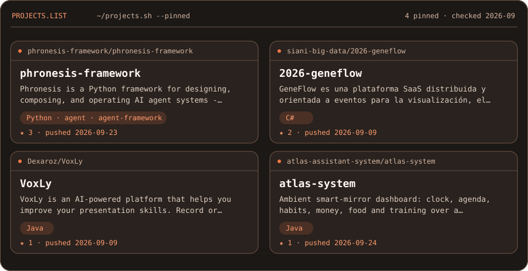

  <a href="https://eduardomarrero.dev/es">Website</a> ·
  <a href="https://www.linkedin.com/in/eduardomarreroglezz/">LinkedIn</a> ·
  <a href="https://github.com/Dexaroz">GitHub</a>

### Highlights

| Open source | Applied AI | Useful software |
| :--- | :--- | :--- |
| Tools for building and observing agent systems. | Projects involving data, vision and language. | Products designed around everyday problems. |

